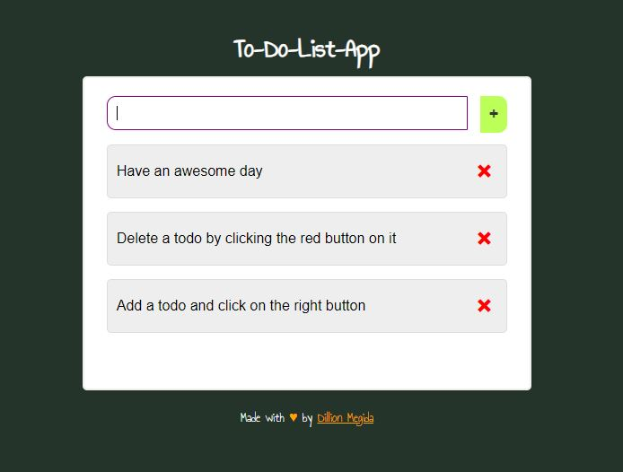

# simple-to-do-app
A very simple and basic to-do application which makes use of browsers localstorage. No server required. Very handy for making to-dos quickly.
It is also a Progressive Web Application (PWA) which makes it installable on device.

### Preview

